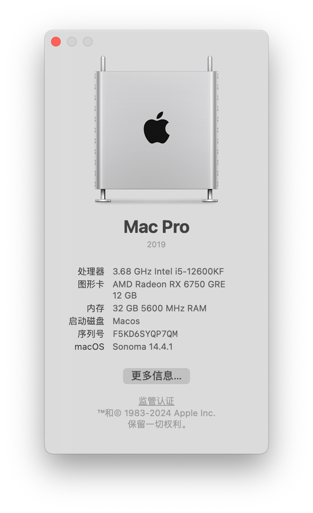

# OC_B760M_AX101_6750GRE

## 展示

## 配置

- CPU i5 12600KF 6大核4小核 10核16线程 无核显
- 主板 铭瑄B760M终结者 D5 WiFi
- 内存 玖合 DDR5 5600Mhz 16G * 2
- 固态 致钛 TiPlus 7100 1T
- 网卡
  - 板载有线网卡
  - Intel AX101
- 显卡 蓝宝石6750GRE 12G 白金版

- 系统 **Sonoma 14.6**

## 功能情况

- [x] 大小核
- [x] WiFi
- [x] 蓝牙
- [x] 网线
- [x] 独立显卡与H265、H264硬解
- [x] USB除了板载第一排屏蔽了，其他都正常（因为第一排是HUB，会导致有时USB失效）
- [x] 睡眠（睡到内存风扇断电与USB键鼠可唤醒）
- [ ] 无法开启网络共享（热点）

## BIOS设置

- 关闭以下选项
  - 快速启动
  - 支持CSM
  - 安全启动
  - VT-d
  - CFG Lock **必须要关**
- 启用以下选项
  - 4G以上解码
  - 超线程技术
  - EHCI/XHCI Hand-off
